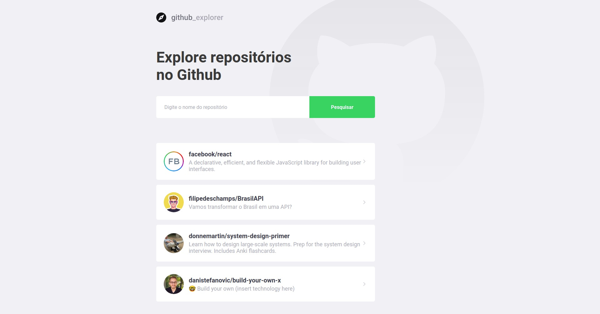
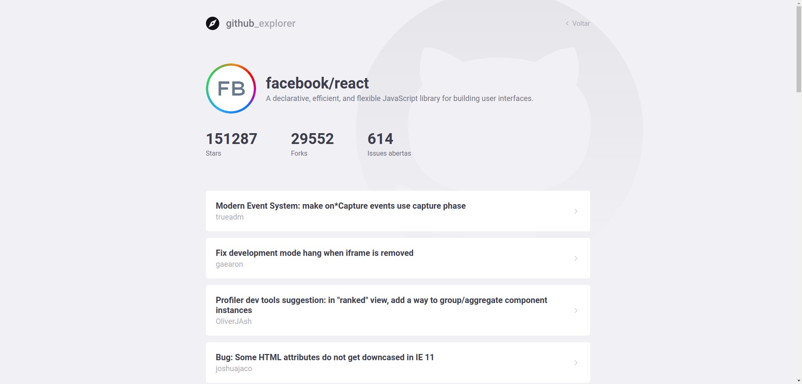

<h1 align="center">
 
  
 
 
GitHub Explorer
</h1>

Permite a listagem de repositórios do github e visualização do numero de Stars, Forks e Issues abertas destes reposiórios, essa aplicação foi
foi desenvolvida durante o Bootcamp da Rocketseat

 Clique <a align="center" href="https://github-explorer-beige.vercel.app/" target="_blank">aqui</a> para ver funcionando

  

## Recursos usados

- **React Js** — Uma biblioteca JavaScript para criar interfaces de usuário
- **Typescript** — Um superset do Javascript que compila para Javascript simples
- **Axios** — Cliente HTTP baseado em promise para o navegador e node.js
- **Styled Components** — Criação de componentes estilizados

## Imagens da aplicação

  
  

## License

This project is licensed under the MIT License - see the [LICENSE](https://opensource.org/licenses/MIT) page for details.
